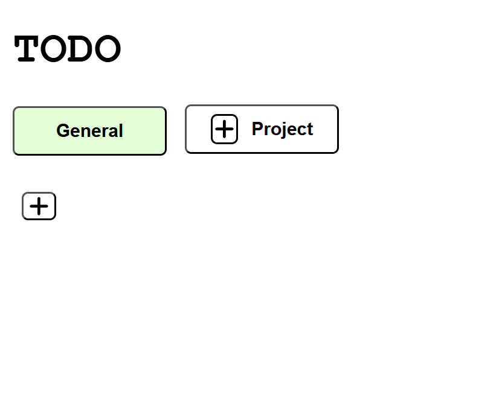
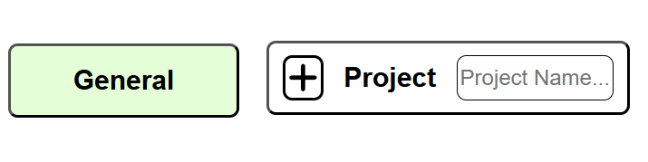
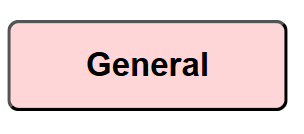
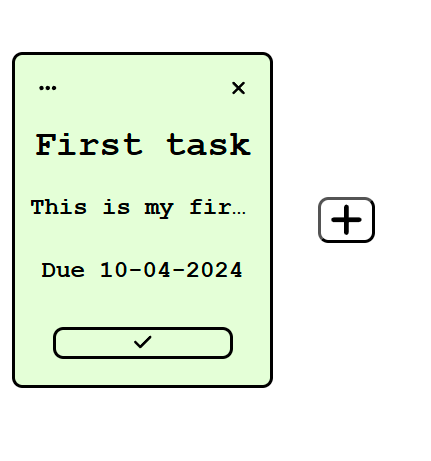
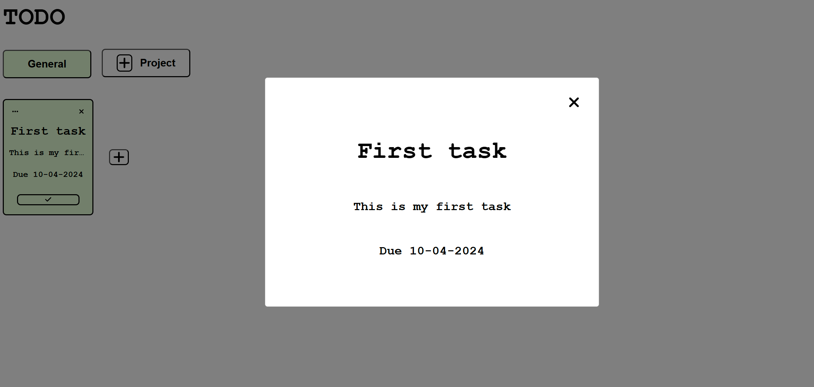

# TODO APP :smile:

## Purpose
### I am creating this todo list with the help of The Odin Project to help solidify concepts such as singular responsibility/oop, dom manipulation, and storing local storage.

## How it works

### This is the application. You can add a task by clicking on the plus icon under the projects.
### Clicking on the project button with a plus icon gives you the ability to add a new project with a custom name.

### You can delete a project by hovering over it for 1 second and then clicking. It will turn red and this will indicate it's ready to be deleted.
### If you just click on a project without waiting it will select the project and display all the tasks under that project.

### Adding a task will give you a form to fill out like this.

### You can easily get a more detailed look at the tasks by clicking the three dots on the top left.

## Connect with me!

### :linkedin: [Connect with me on LinkedIn](https://www.linkedin.com/in/bkeeley24/)

